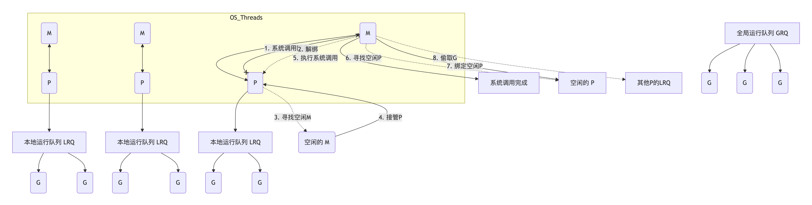

+++
date = '2025-09-20T09:44:15+08:00'
draft = false
title = 'GMP'
+++
### 什么是GMP
#### 概念
GMP是go的协程调度模型，go代码的程序有运行时runtime进行调度，go可以通过运行时进行内存的分配，通过channel进行协程间通信，通过go关键字创建协程。
而GMP正是协程调度的核心。
1. G代表go的goroutine,协程是用户态的轻量级线程，创建销毁的成本非常小，只需要大约2kb，而线程则需要2m,所以go的协程非常适合处理IO密集型任务。
2. M代表系统级线程，go的协程并不真正执行代码，它需要将协程调度到和内核绑定的系统级线程上进行实际的运行。
3. P代表逻辑处理单元，包含了待运行的协程和一些上下文。p又可以分为本地队列和全局队列。
#### 调度过程

go的程序通过runtime创建协程
1. 将协程放到本地队列p
2. p和m绑定
3. m在操作系统上执行
#### 核心调度时机
1. 用户态态阻塞，比如channel、mutex，这个时候p会和m脱离，p会放入到待运行队列，或者重新绑定其他m
2. 内核态阻塞，比如发生了系统调用，io操作等，m会被标记成阻塞状态，go会重新创建后者唤醒一个m，保证并发度
#### 其他核心概念
1. ruetime.GOMAXPROCS()
#### 优化手段

## 进阶（gpt版本）


**GMP 调度的完整流程、设计思想，以及它如何解决了关键问题（如阻塞、抢占）**。

---

### 一、 什么是 GMP 模型？（高层概括）

面试官问“说下GMP”，你可以先给一个高层定义，**点出它的核心设计思想：解耦和复用**。

**回答范例：**

GMP 是 Go 语言运行时的核心调度模型，它是一个**用户态的、M:N 的并发调度器**。

* **M:N** 指的是它将 **M** 个 Goroutine（G）调度到 **N** 个操作系统线程（M）上执行。
* 它的核心设计思想是**解耦**：
    1.  **G（Goroutine）：** 代表一个并发**任务**。它非常轻量（初始栈 2KB），由 Go Runtime 管理，切换成本远低于线程。
    2.  **M（Machine）：** 代表一个操作系统**线程**。它是真正执行计算的“工人”。
    3.  **P（Processor）：** 代表一个逻辑**处理器**，或者说是“CPU 核心”。P 是 G 和 M 之间的“上下文”或“调度器”。M 必须持有 P 才能执行 G。

GMP 模型的精妙之处在于 **P**，它作为中间层，实现了 Goroutine 和 OS 线程的解耦。这带来了两大好处：

1.  **高效复用（M:N）：** M（线程）的数量可以远小于 G（任务）的数量。Go 默认让 P 的数量（`GOMAXPROCS`）等于 CPU 核心数，使得 M:N 调度能充分利用多核，同时避免了大量线程切换的开销。
2.  **智能调度：** 通过 P 的本地队列和 P 之间的**工作窃取 (Work Stealing)** 机制，实现了高效的负载均衡。

---

### 二、 GMP 调度的核心流程（面试重点）

这部分是面试的“深水区”，你需要清晰地描述 G、M、P 是如何协同工作的。

#### 1. 正常执行与创建 (Happy Path)

1.  **启动：** Go Runtime 会创建 `GOMAXPROCS` 个 P。
2.  **绑定：** 一个 M 必须**获取**一个 P 才能开始执行。
3.  **找任务：** M 会从它绑定的 P 的**本地可运行队列（LRQ, Local Run Queue）** 中弹出一个 G。
4.  **执行：** M 执行这个 G。
5.  **`go func()`：** 当一个 G 执行 `go func()` 创建新 G 时，这个新 G **优先**被放入*当前 P* 的 LRQ。如果 LRQ 满了，才会溢出到**全局队列（GRQ, Global Run Queue）**。

#### 2. 工作窃取 (Work Stealing)（解决P饥饿）

**面试官追问：** “如果一个 P 的本地队列空了，它绑定的 M 会做什么？”

**回答：**
这会触发**工作窃取（Work Stealing）**：

1.  当前 M（持有 P1）发现 P1 的 LRQ 为空。
2.  M 不会休眠，它会代表 P1 去**随机**地“偷”另一个 P（比如 P2）的 LRQ。
3.  它会尝试从 P2 的 LRQ **队尾**（*注意：是队尾，保证公平性*）偷走一半的 G 放到 P1 的 LRQ 中。
4.  如果偷不到（所有 P 都空了），它会尝试从 GRQ 获取任务。
5.  如果 GRQ 也为空，M 最终会放弃 P，M 自身进入休眠（自旋等待或挂起），P 被标记为空闲。

**设计思想：** 工作窃取是 GMP 实现高吞吐和负载均衡的关键。它让 M 始终保持“忙碌”，避免了 CPU 资源的浪费。

#### 3. 阻塞处理 (Syscall)（GMP最精妙的设计之一）

**面试官高频追问：** “如果一个 G 发生了阻塞的系统调用（比如 CGO 或文件 IO），会发生什么？会阻塞 M 吗？”

**回答：**
这是 GMP 模型的关键优势。Go 将系统调用分为**阻塞型**和**非阻塞型**（如网络 IO，由 netpoller 内部处理，G 会被挂起，M 不阻塞）。

对于**阻塞型系统调用 (Blocking Syscall)**：

1.  G（G1）在 M1 上执行，即将发生阻塞。
2.  Go Runtime 会检测到这个阻塞。
3.  **关键操作：M1 会与 P 解绑 (M-P detachment)。**
4.  M1 会带着 G1 一起进入阻塞状态（等待 syscall 返回）。
5.  Runtime 会**立即唤醒或创建一个新的 M（M2）** 来接管这个 P。
6.  M2 绑定 P，然后继续从 P 的 LRQ 中取出下一个 G（G2）来执行。

**结果：** 只有 M1 和 G1 被阻塞了，而 P（代表的 CPU 核心）**没有被阻塞**，它立刻被 M2 复用去执行其他 G。

**追问：** “当 G1 的 syscall 返回后呢？”

1.  G1 变为可运行状态。
2.  M1 会尝试**“手持”**（Hand Off）G1：
    * 如果能立即找到一个空闲的 P，M1 就绑定 P 并继续执行 G1。
    * 如果找不到空闲的 P，M1 会将 G1 放入 GRQ，然后 M1 自身进入休眠。

**设计思想：** 这种 M-P 解绑机制，保证了 `GOMAXPROCS` 个 P（即 CPU 核心）始终在满负荷工作，不会因为个别 G 的阻塞而导致整个 M 链条（P）的闲置。

#### 4. 抢占调度（解决G饥饿）

**面试官追问：** “如果一个 G 恶意执行 `for {}` 死循环，它会占满 P 吗？其他 G 怎么办？”

**回答：**
Go 调度器是**抢占式**的。如果一个 G 运行时间过长（目前是 10ms），调度器会强制它让出 CPU。Go 1.14 以后实现了基于信号的异步抢占，解决了早期协作式抢占的痛点。

1.  **协作式抢占（旧，但仍在用）：** Go 编译器会在函数调用的入口处插入“栈检查”指令。这个检查不仅看栈是否溢出，也检查全局的“抢占标记”。如果发现自己需要被抢占，G 会主动让出（切换到 G0 调度栈）。
    * *缺点：* 如果 G 执行一个没有函数调用的纯计算 `for {}`，协作式抢占会失效。

2.  **异步抢占（Go 1.14+，基于信号）：**
    * Go Runtime 有一个系统监控线程（`sysmon`）。
    * `sysmon` 会监控所有 P 上的 G 是否运行时间过长（>10ms）。
    * 如果发现 G1 运行超时，`sysmon` 会向运行 G1 的 M **发送一个 `SIGURG` 信号**。
    * M 接收到信号后，会中断 G1 的执行，将 G1 的状态改为 `runnable` 并将其**插入 GRQ**（使其排到队尾，防止其立即再次执行）。
    * M 随后从 P 的 LRQ 中寻找下一个 G 来执行。

**设计思想：** 异步抢占保证了调度器的公平性，防止了恶意或有 Bug 的 G 饿死其他 G。


# 5. 挂起与恢复


> “被挂起的 G 不运行了，那它放到哪里去了？”

正好是 Go 调度器（GMP 模型）里最关键的“**阻塞与等待队列机制**”之一。
我们来完整拆解。

---

## 🧩 一、前提：G（goroutine）的生命周期阶段

在 Go 的运行时系统中，每个 goroutine（G）有一个状态（`gstatus`），
其中几个关键状态如下 👇

| 状态名          | 含义            |
| ------------ | ------------- |
| `_Grunnable` | 就绪态，可被调度执行    |
| `_Grunning`  | 正在执行          |
| `_Gwaiting`  | **等待中（被挂起）**  |
| `_Gsyscall`  | 处于系统调用中（M 阻塞） |
| `_Gdead`     | 已退出或未初始化      |

---

## 🧠 二、当 G 被挂起时，会发生什么？

当一个 goroutine 因为 **channel、mutex、select、cond 等原因阻塞** 时：

1️⃣ runtime 检测到它不能继续执行
2️⃣ 把 G 的状态从 `_Grunning` 改为 `_Gwaiting`
3️⃣ 将它加入相应的 **等待队列（wait queue）**
4️⃣ 当前 M 继续执行其他可运行的 G（不 handoff P）

---

## 📦 三、挂起的 G 被放到哪里？

这取决于它**被什么阻塞**。
我们可以看几个常见场景：

---

### ✅ 场景 1：Channel 阻塞

```go
ch := make(chan int)
<-ch // 无数据可读，被挂起
```

执行 `<-ch` 时：

* runtime 发现 channel 没有可读数据；
* 当前 G（比如 G1）被放入 `ch.recvq` 等待队列；
* G1 状态置为 `_Gwaiting`；
* 调度器立即让出 M 执行其他 G。

📦 **存放位置：`chan.recvq`（链表或队列结构）**

当另一个 G2 向 channel 发送数据时：

* runtime 会从 `recvq` 中取出一个等待的 G；
* 把它状态改回 `_Grunnable`；
* 放入 P 的本地可运行队列（`runq`）；
* 等待被调度执行。

---

### ✅ 场景 2：Mutex 阻塞

```go
var mu sync.Mutex
mu.Lock()
mu.Lock() // 第二次阻塞
```

* 第一个 G1 获得锁；
* 第二个 G2 调用 `Lock()` 时发现锁被占用；
* runtime 把 G2 挂入 `mutex` 的等待队列（`sudog` 结构）；
* G2 状态 `_Gwaiting`；
* 当前 M 去执行别的 G。

📦 **存放位置：锁的等待队列（`sudog`）**

当 G1 调用 `Unlock()` 时：

* runtime 会唤醒一个等待的 G（从 `sudog` 拿出）；
* 改状态为 `_Grunnable`；
* 放入当前 P 的 run queue。

---

### ✅ 场景 3：Cond 阻塞（类似 WaitGroup）

```go
cond.L.Lock()
cond.Wait() // 阻塞
```

* runtime 把当前 G 放入 `cond` 的等待队列；
* 改为 `_Gwaiting`；
* unlock 互斥锁；
* 当前 M 继续执行其他 G。

📦 **存放位置：Cond 的等待队列**

当 `Signal()` 或 `Broadcast()` 调用：

* runtime 取出等待的 G；
* 改状态 `_Grunnable`；
* 放入 run queue。

---

### ✅ 场景 4：select 阻塞（多个 channel 都没就绪）

```go
select {
case <-ch1:
case <-ch2:
default:
    // 不会阻塞
}
```

如果所有 case 都阻塞：

* runtime 把 G 加入所有相关 channel 的等待队列；
* 当任意一个 channel 就绪时，唤醒它；
* 其他等待位置的 entry 会被清理。

📦 **存放位置：多个 channel 的等待队列（sudog 链表）**

---

## ⚙️ 四、唤醒过程（被挂起的 G 重新运行）

当对应事件（如数据到达、锁释放）发生时：

1️⃣ runtime 把等待队列中的 G 拿出来；
2️⃣ 改状态 `_Grunnable`；
3️⃣ 放入 **P 的本地 run queue** 或全局 run queue；
4️⃣ 被某个 M 执行。

🧩 示意：

```
被挂起的 G ——> 等待队列 ——> 事件触发唤醒 ——> run queue ——> M 执行
```

---

## 🔍 五、总结图示

```
┌────────────────────────────┐
│        P (Processor)       │
│                            │
│  本地 run queue            │
│  [G2][G3][G4]              │
└───────────▲────────────────┘
            │
     ┌──────┴──────┐
     │   阻塞事件   │
     │ (chan/mutex)│
     └──────┬──────┘
            │
       挂起的 G1
       状态: _Gwaiting
       存放于等待队列
```

唤醒后：

```
wait queue → G1 状态变为 _Grunnable → 放入 P.runq → 等待调度执行
```

---

## ✅ 六、总结一句话

> 被挂起的 G 不会运行，它被放入**对应资源的等待队列**（chan、mutex、cond 等）。
> 等待资源可用时，runtime 把它唤醒、改为 `_Grunnable`，放回 **P 的 run queue** 等待执行。
> 整个过程 M 与 P 不解绑（不会 handoff），M 会去跑其他 G。

